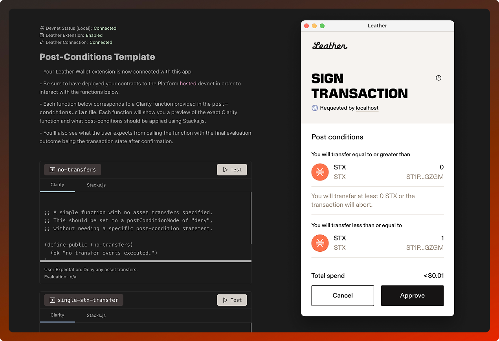
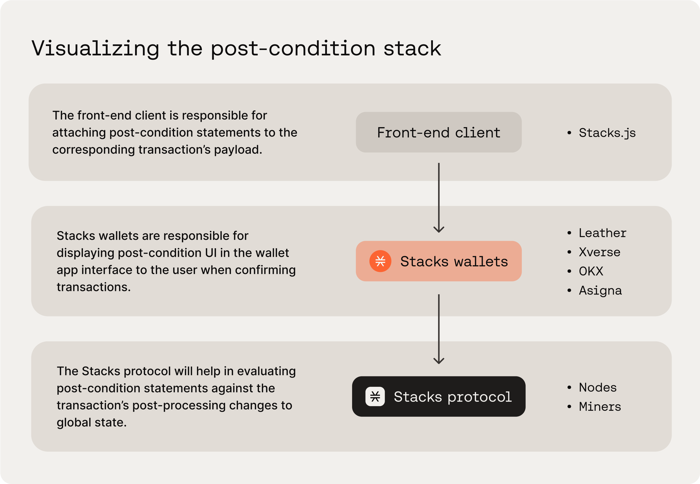

# Post-Conditions Template



This template showcases the power of post-conditions through multiple scenarios you might encounter as a Clarity developer. It's interactive, educational, and usable for further development.

#### What are Post-Conditions?

Post-conditions are assertions, applied on the client-side, about an on-chain transaction that must be met; otherwise, the transaction will abort during execution. In other words, post-conditions act as a safety net, allowing you to specify what state changes should be expected in a transaction. This logic helps limit the amount of damage that can be done to a user and their assets, whether due to a bug or malicious behavior.

> IMPORTANT: For a deeper understanding of post-conditions, supplement this template by reading this dedicated [blog](https://www.hiro.so/blog/a-developers-guide-to-post-conditions) on the topic.

This template specifically is geared towards allowing you to interact with post-conditions on different Clarity functions in an educational manner. The template comes with a Clarity smart contract and front-end app to fully test the full-stack interoperability along with the [Leather](https://www.leather.io) wallet extension. The template comprises of 2 folders:

- `clarity`: A Clarinet project that houses a few different Clarity contracts. The main `post-conditions.clar` contract is what the front-end app will interact with. It contains functions that capture multiple asset transfer scenarios.
- `front-end`: A front-end app, powered by Vue/Vite, for interacting with the different Clarity functions, each with its own unique set of post-conditons required. This is to help you understand the why and how post-conditions are needed.

## Visualizing the Post-Condition Stack

> The below excerpt taken from the dedicated [blog](<(https://www.hiro.so/blog/a-developers-guide-to-post-conditions)>) on post-conditions.

Post-conditions are enforced by the Stacks protocol itself but do not exist in the smart contracts themselves. Instead, they are programmatically constructed in your front-end application code using Stacks.js, specifically by passing them in as options to the transaction payload construction.

By having post-conditions in the frontend code, Stacks-supported wallets, such as Leather and Xverse, are able to display the post-conditions in a human-readable format for the user when confirming their transactions. Once a user confirms the transaction, the post-conditions get carried along with the transaction payload where eventually the Stacks protocol will evaluate them together.



If there were no post-conditions in the front-end application code, a user’s wallet will display an abstract warning message, where it would be up to the user to decide whether they want to blindly proceed with the transaction or not. And whatever the underlying contract code wants to do, it will do without any post-condition restrictions. So if a contract tries to send your STX tokens to a drainer wallet, it will without you knowing.

Even with post-conditions set up on the frontend code, a user is still blind to the underlying Clarity smart contract code, but at least they know what to expect will happen in the transaction. And if that expectation is not met, the transaction will abort and fail.

## Development

To run this app with a Stacks Devnet (either via the Hiro Platform or Clarinet CLI), follow these steps:

1. **Configure Local Environment**

From the root directory, install dependencies:

```bash
npm install
```

In the `front-end` directory, create an `.env` file using the existing `.env.example` file:

```bash
cp front-end/.env.example front-end/.env
```

Add your Hiro Platform API key to the renamed `front-end/.env` file:

```bash
VITE_PLATFORM_HIRO_API_KEY=your-api-key-here
```

2. **Start Devnet in Hiro Platform**

- Log into the [Hiro Platform](https://platform.hiro.so)
- Navigate to your project and start Devnet (No need to update the Devnet deployment plan if it asks)
- Copy your API key from either:
  - The Devnet Stacks API URL: `https://api.platform.hiro.so/v1/ext/<YOUR-API-KEY>/stacks-blockchain-api`
  - Or from https://platform.hiro.so/settings/api-keys

3. **Install the Leather Wallet Extension**

- Install and enable the Leather wallet extension for Chrome supported browsers.
- Import the deployer account's mnemonic seed phrase, from the list of the provided Devnet wallet seed phrases, into your Leather wallet.
- Add a custom network using your Devnet Stacks API URL: `https://api.platform.hiro.so/v1/ext/<YOUR-API-KEY>/stacks-blockchain-api`

> Before starting the front-end app, click the Leather Wallet extension icon in the browser toolbar to open the extension popup and import the deployer account's mnemonic seed phrase of the pre-funded wallets list provided in the <code>Devnet.toml</code> file of your Clarinet (clarity) project directory. You can also find these pre-funded wallets in the Platform Devnet UI. If you're unable to find this, we've got it for you here for convienence: `twice kind fence tip hidden tilt action fragile skin nothing glory cousin green tomorrow spring wrist shed math olympic multiply hip blue scout claw`. This deployer account is tied to the testnet address of `ST1PQHQKV0RJXZFY1DGX8MNSNYVE3VGZJSRTPGZGM`.

4. **Start the Frontend Application**

Start the Vue/Vite application from the `front-end` directory.

```bash
cd front-end
npm run dev
```

Visit `[http://localhost:5173](http://localhost:5173)` in your browser to view and interact with the app. If devnet is running and the wallet extension is enabled in your browser, then you should be able to connect the app with the wallet for further interaction.

## About the Smart Contract

This app uses a Clarity smart contract which covers different asset transfer scenarios.

### `post-conditions.clar`

Each function in this contract is designed to simulate various asset transfer scenarios that post-conditions are setup to cover on the front-end.

- `no-transfers`: A simple function with no asset transfers specified.
- `single-stx-transfer`: A function that contains a single asset transfer of STX from the tx-sender to the contract.
- `multiple-stx-transfers`: When multiple transfer events happen for the same asset on the same address, your post-condition statement should aggregate the net total amount of that asset being transferred during the execution of the entire function.
- `mint-and-burn-events`: A post-condition statement is needed for burn events, but not needed for mint events.
- `uncertain-asset-amount`: The function below demonstrates a scenario where the amount of STX to send is dynamic. Having two post-condition statements that capture a range would be appropriate.
- `hidden-asset-transfers`: The function below contains a bunch of asset transfer events that are obfiscated in a way where it may not be noticeable at first glance. It's setup for the tx-sender to pay for a cool-nft for 2 STX, but unbeknownst to the user, the function will attempt to transfer out a few of the user's good tokens AND send the users some evil tokens.

### `good-token.clar`

A SIP010 fungible token contract setup to initially fund the deployer wallet `ST1PQHQKV0RJXZFY1DGX8MNSNYVE3VGZJSRTPGZGM` with 500 Good tokens. It's used in the `hidden-asset-transfers` scenario to depict an attempt at draining a certain token from your wallet. On the front-end, you will learn how to construct post-conditions on fungible tokens and how properly constructed post-conditions would prevent this asset transfer.

### `evil-token.clar`

A SIP010 fungible token contract setup to initially fund the `post-conditions.clar` contract with 500 Evil tokens. It's used in the `hidden-asset-transfers` scenario to depict an attempt where you are being sent scam/spam tokens. On the front-end, you will learn how to construct post-conditions on fungible tokens and how properly constructed post-conditions would prevent this asset transfer.

### `cool-nft.clar`

A SIP009 non-fungible token contract setup to initially fund the `post-conditions.clar` contract with a handful of NFTs. It's used in the `hidden-asset-transfers` scenario to depict paying for an NFT. On the front-end, you will learn how to construct post-conditions on non-fungible tokens.

## Using Devnet

The Hiro Platform's Devnet is a sandboxed, personal blockchain environment for testing your dApps before deploying them to the testnet or mainnet. Each time you start a new Devnet, it will reset the blockchain state and deploy your project contracts from scratch.

This is useful because deployments to the blockchain are permanent and cannot be undone. Ensure you have tested your contracts thoroughly in your Devnet before promoting them to Testnet or Mainnet.

If you make changes to your contract, you will need to push your changes and restart Devnet for the contract changes to appear in your Devnet.

For this template, the `front-end` directory contains the below environment variables in the `.env` file for you to config your devnet:

- VITE_PLATFORM_HIRO_API_KEY=`<YOUR-API-KEY>`

## Next Steps

Once you've thoroughly tested the contract and front-end app in Devnet, and are confident in its functionality, you can proceed to building out the template with your own use case that properly leverages the security of post-conditons.
